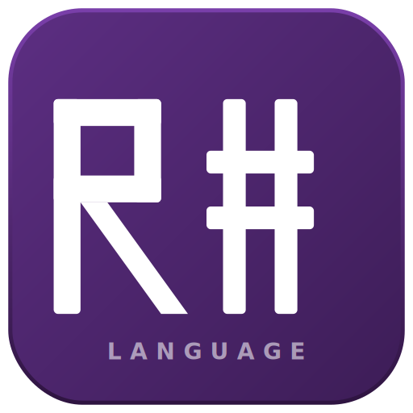

# R# - Systems Programming Language


[](https://github.com/StudioBalmung/rsharp/actions)
[](LICENSE)
[](https://github.com/StudioBalmung/rsharp/releases)

> **High performance. Memory safety without the ceremony.**

R# is a compiled systems language that targets LLVM for native code generation.  
It uses **single ownership + borrow checking** for memory safety, **arena-only allocation** for zero-GC predictability, and `comptime` generics for zero-cost abstractions — while keeping syntax approachable enough that you can learn the whole language in a weekend.

---

## Quick Look

```rsl
// hello_world.rsl
fn main() => i32 {
    @print("Hello, World!")
    0
}
```

```rsl
// Short form — expression body
fn main() => @print("Hello, World!")
```

```rsl
// Structs, methods, error handling, match
struct Vec2 { x: f32, y: f32 }

impl Vec2 {
    pub fn len(self) => f32 { @sqrt(self.x*self.x + self.y*self.y) }
    pub fn add(self, o: Vec2) => Vec2 { Vec2 { x: self.x+o.x, y: self.y+o.y } }
}

enum ParseError {
    InvalidInput { msg: str },
    Overflow,
}

fn parse_coord(s: str) => Result<Vec2, ParseError> {
    let parts = try s.split(",").collect()
    let x = try @parse_f32(parts[0]).map_err(|e| ParseError::InvalidInput { msg: e })
    let y = try @parse_f32(parts[1]).map_err(|e| ParseError::InvalidInput { msg: e })
    Ok(Vec2 { x, y })
}

fn main() => i32 {
    let v = parse_coord("3.0,4.0") catch |e| {
        match e {
            .InvalidInput { msg } => @print("bad input: {}", msg),
            .Overflow             => @print("number too large"),
        }
        return 1
    }
    @print("len = {}", v.len())    // 5.0
    0
}
```

```rsl
// Comptime generics — resolved entirely at compile time, zero runtime overhead
fn Vec(comptime T: type, comptime N: u32) => type {
    struct {
        data: [T; N],
        fn dot(self, o: @This()) => T {
            var s: T = 0
            comptime for i in 0..N { s += self.data[i] * o.data[i] }
            s
        }
    }
}

let Vec3f = Vec(f32, 3)
let a = Vec3f { data: [1.0, 2.0, 3.0] }
let b = Vec3f { data: [4.0, 5.0, 6.0] }
@print("{}", a.dot(b))    // 32.0
```

---

## Why R#?

| Feature | R# | Rust | Zig | C++ |
|---|---|---|---|---|
| Performance | Native (LLVM) | Native | Native | Native |
| Memory safety | Ownership | | Manual | |
| Lifetime annotations | Rarely needed | Required | N/A | N/A |
| Garbage collector | None | | | |
| Comptime generics || Partial || Partial |
| Error handling | `Result`+`catch` | `Result`+`?` | Error union | Exceptions |
| Learning curve | 🟢 Low | 🔴 High | 🟡 Medium | 🔴 Very High |
| C interop | Direct | Via `unsafe` | Direct | Direct |

---

## Installation

### Prerequisites
- CMake ≥ 3.22
- GCC ≥ 12 or Clang ≥ 16
- Python ≥ 3.11 (interpreter/REPL)
- LLVM ≥ 17 *(optional — required for native compilation)*

### Build

```bash
git clone https://github.com/StudioBalmung/rsharp
cd rsharp

# Toolchain only (no LLVM — lexer/parser/sema + rsl CLI)
cmake -B build -DCMAKE_BUILD_TYPE=Release
cmake --build build
sudo cmake --install build

# Full build with LLVM backend
cmake -B build -DCMAKE_BUILD_TYPE=Release -DRSHARP_WITH_LLVM=ON
cmake --build build
sudo cmake --install build
```

### Verify

```bash
rsharp --version
# rsharp 1.0.0 (rsl 1.0.0, rsc 1.0.0, edition 2025)
```

---

## Getting Started

```bash
rsl new my_project
cd my_project
rsl run
```

Full tutorial: **[docs/LANGUAGE_GUIDE.md](docs/LANGUAGE_GUIDE.md)**

---

## File Extensions

| Extension | Purpose |
|-----------|---------|
| `.rsl` | R# Language source (primary) |
| `.rsh` | R# Header / interface definition |
| `.rss` | R# Script (interpreted) |
| `.rsp` | R# standalone Program |
| `.rslib` | R# compiled Library |

GitHub Linguist support via `.gitattributes` — your repo shows **R#** as the language.

---

## rsl — Build & Package Manager

```bash
rsl new <name>       # create project
rsl build            # debug build
rsl build --release  # release build
rsl build pkg        # build library
rsl run              # build + run
rsl check            # type-check only
rsl test             # run tests
rsl fmt              # format sources
rsl doc              # generate docs
rsl install qt5      # install package
rsl add serde@1.0    # add dependency
rsl clean            # clean artifacts
rsharp --version     # toolchain version
```

---

## Architecture

```
source.rsl
   │
   ├─ Lexer (C11)          tokens
   ├─ Parser (C11)         AST
   ├─ Type Sema (C11)      typed AST
   ├─ Ownership (C11)      verified AST
   └─ LLVM Backend (C++20) → native binary
                           → wasm
                           → LLVM IR

   Interpreter (Python)    → REPL / .rss scripts
```

Full details: **[docs/ARCHITECTURE.md](docs/ARCHITECTURE.md)**

---

## Project Structure

```
rsharp/
├── compiler/
│   ├── lexer/          Tokenizer (C11)
│   ├── parser/         AST + recursive-descent parser (C11)
│   ├── sema/           Type checker + ownership (C11)
│   ├── ir/             High-level IR (C11)
│   └── codegen/        LLVM IR emitter (C++20)
├── runtime/
│   ├── memory/         Arena allocator (C11)
│   ├── ffi/            C interop helpers
│   └── interpreter/    Tree-walking interpreter (Python)
├── stdlib/
│   ├── core/           core.rsl, arena.rsl, option.rsl, result.rsl
│   ├── io/             io.rsl
│   ├── math/           math.rsl
│   ├── collections/    vec.rsl, map.rsl
│   └── smart_ptr/      box.rsl, rc.rsl, arc.rsl
├── tools/
│   ├── rsl/            Unified CLI (rsl + rsharp binary)
│   ├── rsc/            Compiler driver
│   ├── rsrun/          Script runner
│   ├── rsfmt/          Formatter
│   └── rsdoc/          Documentation generator
├── examples/
│   └── showcase/       hello_world, fizzbuzz, enums, ownership,
│                       generics, async, smart_ptrs, FFI, ...
├── tests/
│   ├── unit/           C unit tests (lexer, parser, sema)
│   └── integration/    R# integration tests
├── docs/
│   ├── LANGUAGE_GUIDE.md
│   ├── ARCHITECTURE.md
│   ├── PACKAGES.md
│   └── CHANGELOG.md
├── Rsharp.toml         Project manifest
├── CMakeLists.txt      Build system
├── .gitattributes      GitHub language detection
└── .github/
    ├── workflows/ci.yml
    └── linguist/RSharp.yml
```

---

## Roadmap

- [x] Language specification (v1.0)
- [x] Arena allocator
- [x] Lexer (complete R# 1.0 token set)
- [x] AST node definitions
- [x] Diagnostic / error renderer (Rust-quality messages)
- [x] Recursive-descent parser
- [x] Type checker (sema pass)
- [x] Compiler driver (`rsc`)
- [x] Unified CLI (`rsl` / `rsharp`)
- [x] LLVM backend interface (C++20)
- [x] Tree-walking interpreter (Python)
- [x] Standard library (core, io, math, collections, smart_ptr)
- [x] GitHub Linguist / `.gitattributes`
- [x] CI (Linux x64, ARM64, WASM)
- [ ] LLVM IR emitter (complete)
- [ ] Ownership checker pass
- [ ] `rsfmt` formatter
- [ ] `rsdoc` generator
- [ ] Package registry
- [ ] Self-hosted parser (written in R#)
- [ ] Windows target
- [ ] Apple Silicon target

---

## License

MIT - see [LICENSE](LICENSE).

---

*© Studio Balmung · Neofilisoft*
